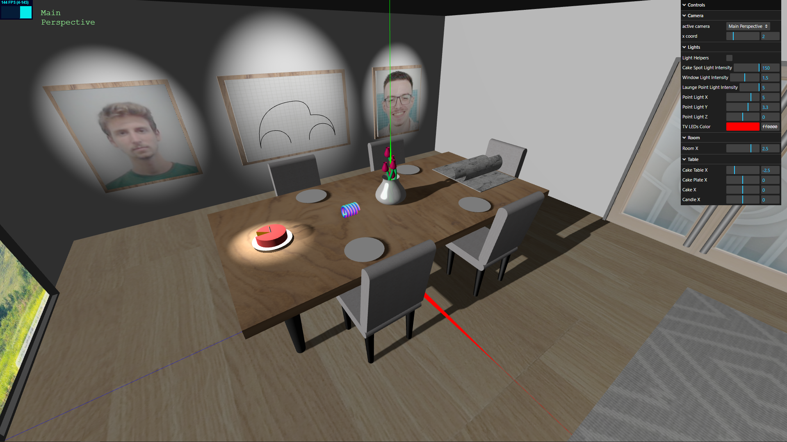
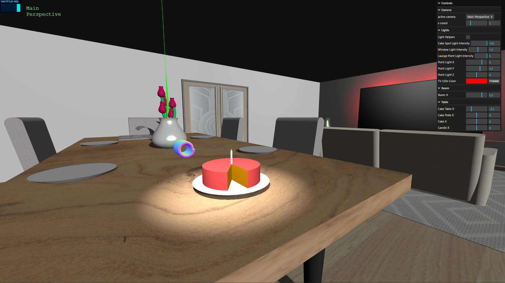
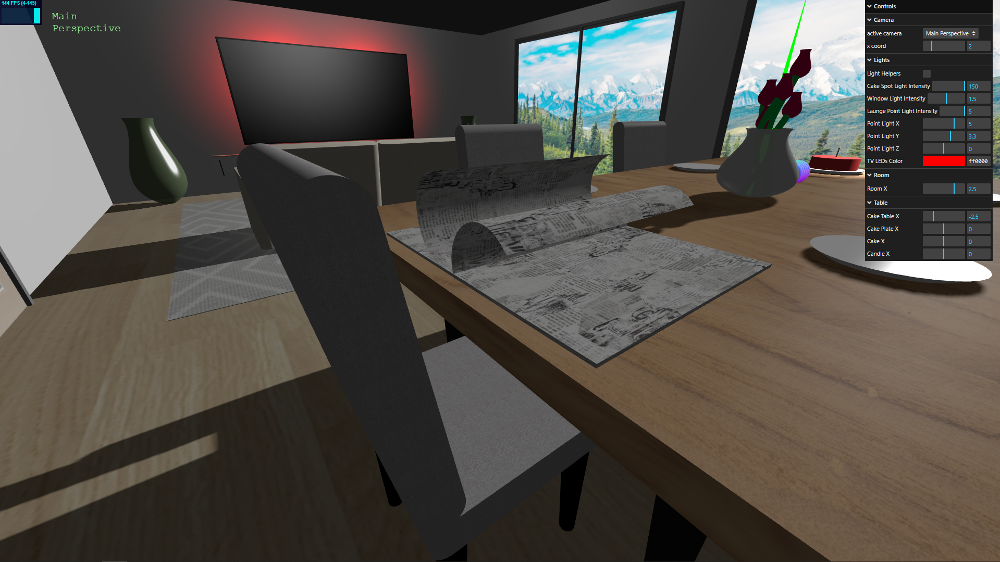
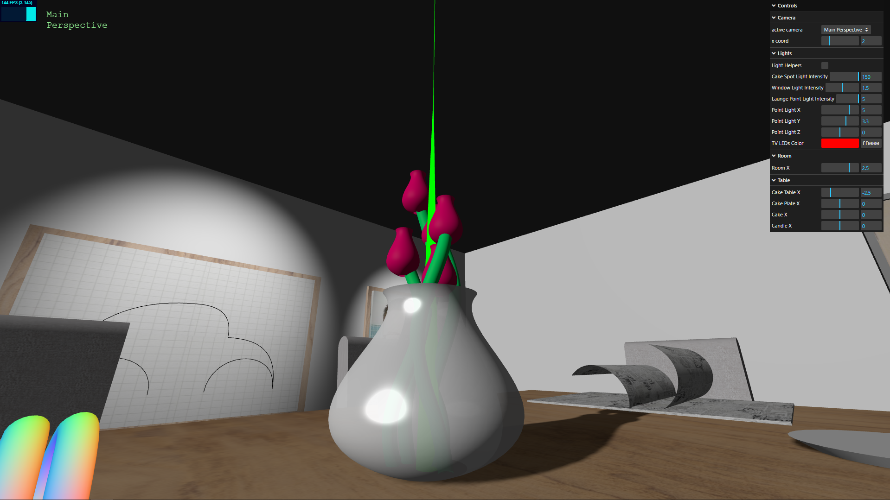
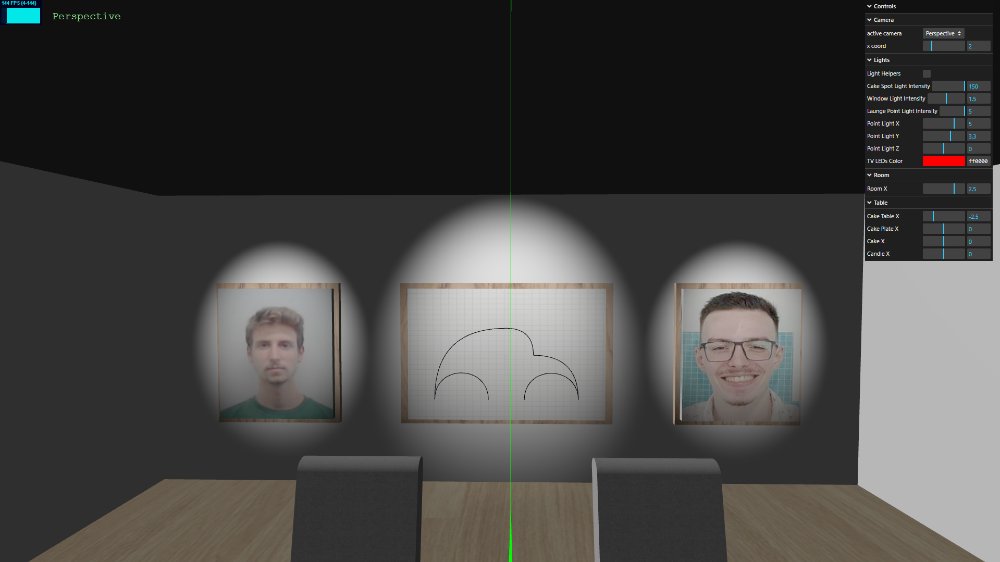
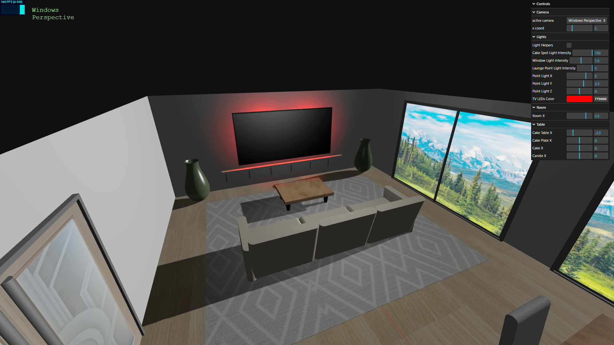
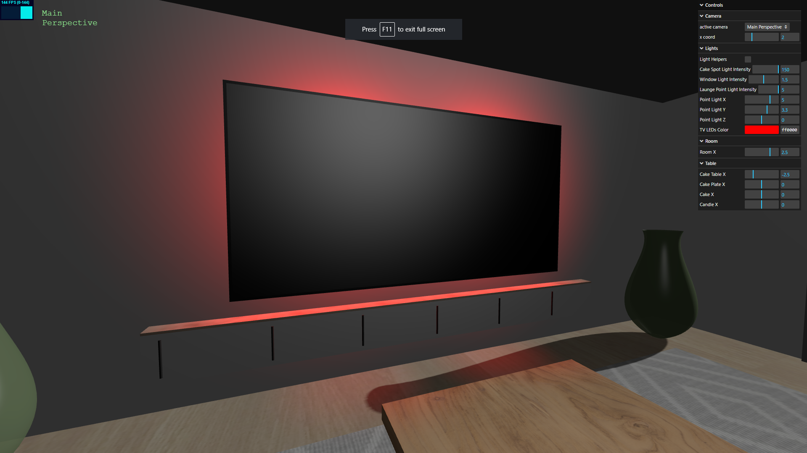
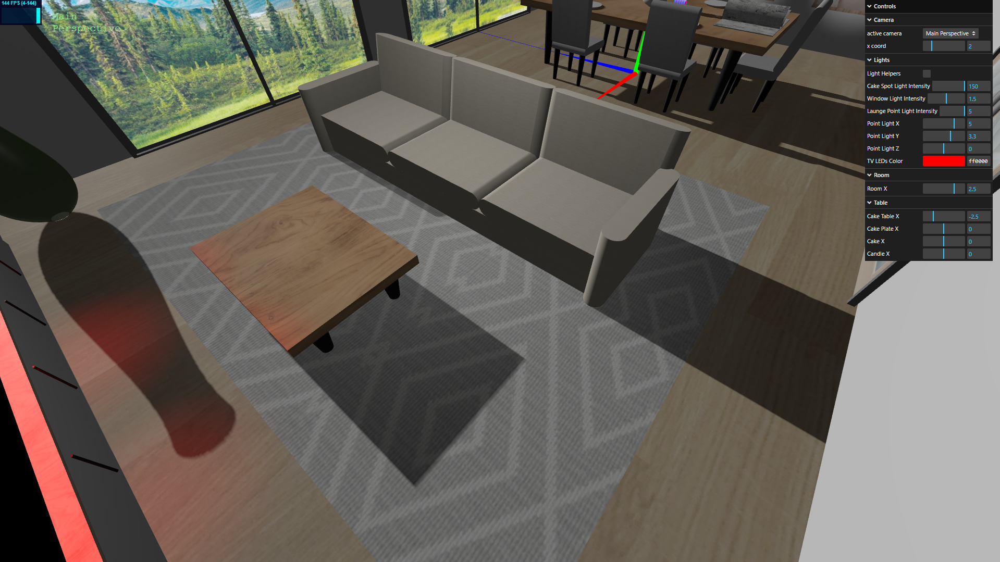
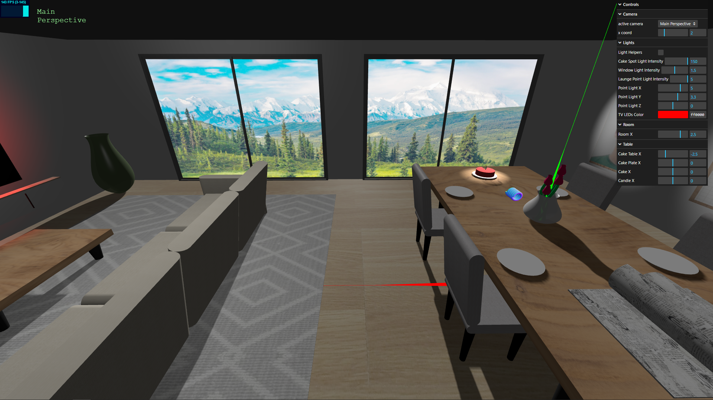
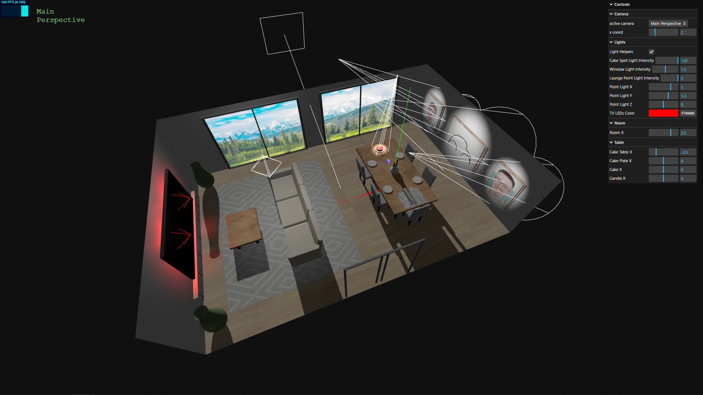

# SGI 2023/2024 - TP1

## Group: T06G01

| Name             | Number    | E-Mail             |
| ---------------- | --------- | ------------------ |
| Frederico Lopes  | 201904580 | up201904580@edu.fe.up.pt |
| Nuno Jesus       | 201905477 | up201905477@edu.fe.up.pt |

----
## Project information

### Elements
- Highly specular jars
- NURBS roses (NURBS spiral stalk, spheric pollen and NURBS petals)
- TV LED lights simulated with point lights
- NURBS spring covered in a Normal Material
- Journal, created with 2 curved journal pages and 2 flat ones
- 3-seat sofa created with a stretched cylinder geometry
- 2 large sliding, windows together with a directional light
- Shadows over tables, chairs, sofa and others
- Customizable "LED lights" on the back of the television

### Scene
- The scene is composed of 2 big areas: the launge area and the table area
- The **table area** contains a table, plates and a cake on top of one, together with multiple chairs.
- A spring, a flower jar and a journal can also be found on top of the table.
- Behind the table we can find the pictures of us and the car drawing. Next to the table we have 2 large windows on one side and a door on the other.
- The **launge area** is made of a sofa, rug, small table, TV, TV cabinet, 2 jars and LED lights behind the television
- Objects such as the sofa, chairs, tables, windows, door and pictures were painted with a texture

----
## Screenshots

### Table Area

### Launge Area

### Light sources

----

## Issues/Problems

- Troubles understanding why the lookAt function wouldn't change the direction of the cameras and, instead, would simply leave the cameras pointing to the origin