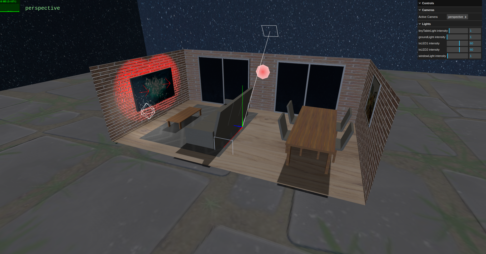
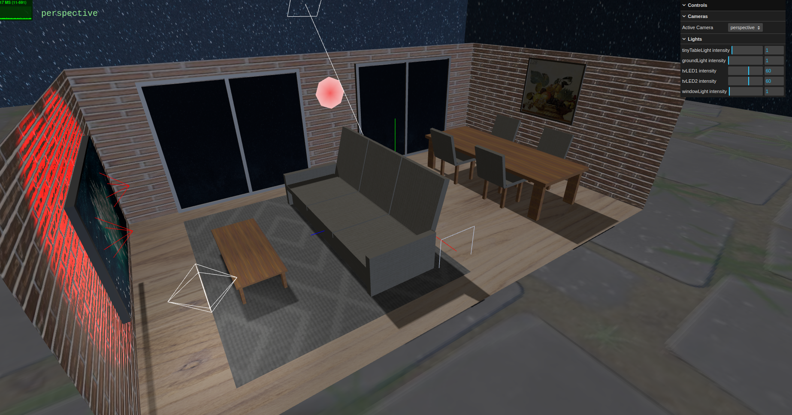
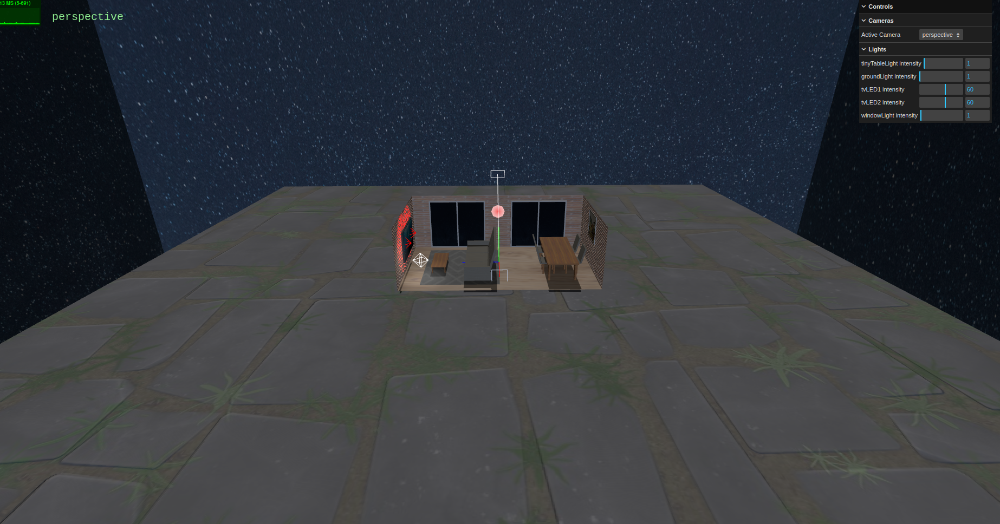
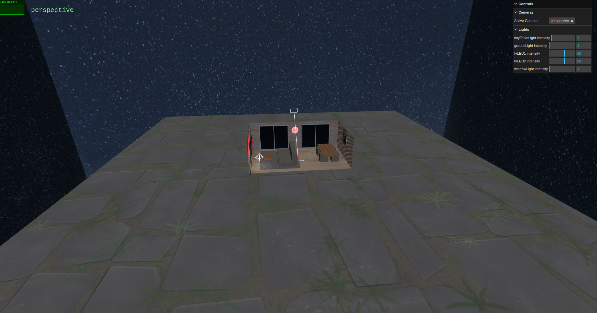

# SGI 2023/2024 - TP2

## Group: T06G01

| Name             | Number    | E-Mail             |
| ---------------- | --------- | ------------------ |
| Frederico Lopes  | 201904580 | up201904580@edu.fe.up.pt |
| Nuno Jesus       | 201905477 | up201905477@edu.fe.up.pt |

----
## Project information

### Elements
- Brick walls with bump texture
- Wooden floor of the house
- World floor with bump texture
- LODs in the tables, sofa and chairs
- TV LED lights simulated with point lights
- TV with video texture
- Painting with manual Mipmap texture
- 3-seat sofa 
- 2 large sliding windows, with a view to the outsie 
- 2 tables
- A rug over the house floor
- 4 chairs
- Shadows over table and sofa
- Lights with variable intensities over the scene
- Skybox with nightsky view
- Polygon with 8 vertices and a darker interior, losely resembling a dartboard

### Scene
- The scene is composed of 2 big areas: the house and the exterior
- The **house** is made of brick walls, has a wooden floor and has all the elements described before.
- The **exterior** is sorrounded by nightsky and has a stone floor. Fog can also be seen if zoomed out enough.

----
## Screenshots

### House

### Exterior

----

## Issues/Problems

- Troubles understanding why the lookAt function wouldn't change the direction of the cameras and, instead, would simply leave the cameras pointing to the origin